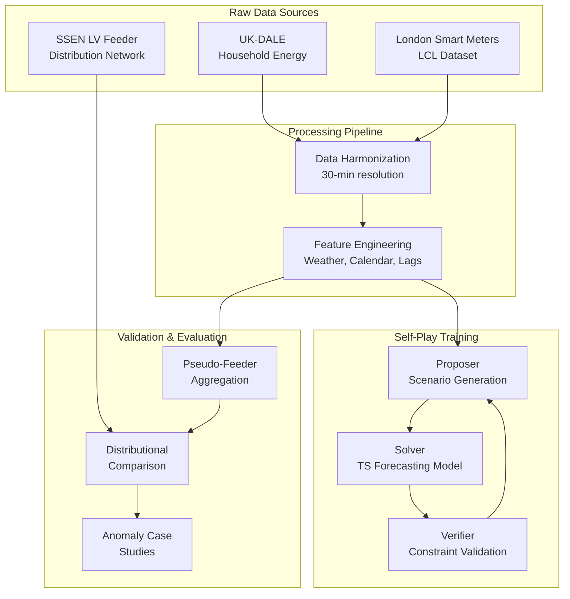

# AZR-inspired Energy Forecasting & Anomaly Detection

[](https://github.com/vatsalmehta/FYP-Predictive_Anomaly_Detection/actions)
[](https://opensource.org/licenses/MIT)
[](https://www.python.org/downloads/)

A production-grade machine learning system that adapts the propose→solve→verify self-play paradigm from **Absolute Zero Reasoner (AZR)** ([arXiv:2505.03335](https://arxiv.org/abs/2505.03335)) to time series forecasting and anomaly detection in energy consumption data.

## Project Vision

This Final Year Project explores how self-play reinforcement learning can enhance time series forecasting by training models to propose challenging scenarios, solve them accurately, and verify solutions through realistic constraints. We focus on household energy consumption prediction with validation against real distribution network feeders.

**Key Innovation**: Unlike traditional supervised learning on historical data, our approach generates synthetic scenarios that stress-test model capabilities while maintaining physical plausibility through verifiable reward signals.

## Data Flow Architecture



## USP

- **Latest Architectures**: PatchTST and N-BEATS variants with uncertainty quantification
- **Verifiable Rewards**: Physics-based constraints ensure realistic scenario generation
- **Multi-Scale Validation**: Household-level accuracy with feeder-level realism checks
- **Production MLOps**: DVC data versioning, MLflow experiment tracking, comprehensive CI/CD
- **Uncertainty Quantification**: Quantile regression heads and Monte Carlo dropout
- **Open Science**: Reproducible experiments with clear data governance

## Project Status

**Current Phase**: Data Ingestion & Exploration  
**Next Milestone**: Self-Play Prototype Implementation

<table>
<tr><th>Completed</th><th>In Progress</th><th>Upcoming</th></tr>
<tr>
<td>

- Data infrastructure (DVC)
- Datasets acquired (15.2GB)
- Ingestion pipeline built
- Baseline models implemented
- Testing framework

</td>
<td>

- Full dataset ingestion
- Exploratory analysis
- Anomaly strategy defined
- SSEN constraint extraction

</td>
<td>

- Self-play architecture
- Proposer/Verifier agents
- Model training
- Evaluation & writing

</td>
</tr>
</table>

### Datasets Overview

| Dataset | Size | Records | Households | Purpose |
|---------|------|---------|------------|---------|
| **LCL** (London Smart Meters) | 8.54 GB | ~167M readings | 5,567 | Training & validation |
| **UK-DALE** | 6.33 GB | ~114M readings | 5 houses | Appliance-level analysis |
| **SSEN** (Feeder Metadata) | 36.7 MB | ~50K feeders | N/A | Physical constraints |
| **Total** | **~15 GB** | **~281M readings** | **5,572+** | — |

All datasets tracked with DVC. See `data/README_raw.md` for access instructions.

## Quick Start

### Prerequisites
- Python 3.11+
- [Poetry](https://python-poetry.org/) for dependency management
- Git with LFS support

### Installation

```bash
# Clone the repository
git clone https://github.com/vatsalmehta/FYP-Predictive_Anomaly_Detection.git
cd FYP-Predictive_Anomaly_Detection

# Install dependencies
poetry install

# Activate virtual environment
poetry shell

# Install pre-commit hooks
pre-commit install

# Pull data if remote configured (optional)
# dvc pull

# Run smoke tests
pytest tests/

# Verify pipeline (placeholder stages)
dvc repro
```

### Data Onboarding

This project uses **DVC (Data Version Control)** to manage large datasets while keeping Git repositories lightweight.

#### For Quick Testing/CI
```bash
# Use built-in synthetic samples (already available)
ls data/samples/
# → lcl_sample.csv, ukdale_sample.csv, ssen_sample.csv
```

#### For Full Development
```bash
# 1. Download datasets (see docs/download_links.md for sources)
#    Place in: data/raw/ukdale/, data/raw/lcl/, data/raw/ssen/

# 2. Track with DVC
dvc add data/raw/ukdale
dvc add data/raw/lcl  
dvc add data/raw/ssen

# 3. Commit pointers (not data!) to Git
git add data/raw/*.dvc dvc.lock
git commit -m "DVC: track raw datasets via pointers"

# 4. Optional: Set up remote storage for team sharing
dvc remote add -d myremote s3://my-bucket/fyp-data/
dvc push
```

**Dataset Locations:**
- `data/raw/ukdale/` → UK-DALE household consumption 
- `data/raw/lcl/` → London Smart Meters data   
- `data/raw/ssen/` → SSEN distribution feeder data
- `data/samples/` → Tiny synthetic samples for demos/CI

**Resources:**
- [Dataset download links & setup](docs/download_links.md)
- [Complete DVC workflow guide](data/README_raw.md)
- [Ingestion specifications](docs/ingestion_specs.md)
- [Baseline models documentation](docs/baselines.md)

#### Data Ingestion

```bash
# Quick test with samples (no downloads needed)
python -m fyp.ingestion.cli lcl --use-samples
python -m fyp.ingestion.cli ukdale --use-samples
python -m fyp.ingestion.cli ssen --use-samples

# Full ingestion (requires raw data)
python -m fyp.ingestion.cli lcl
python -m fyp.ingestion.cli ukdale --downsample-30min
python -m fyp.ingestion.cli ssen  # Uses CKAN API
```

#### Baseline Models

```bash
# Quick forecasting baselines on samples
python -m fyp.runner forecast --dataset lcl --use-samples

# Anomaly detection baselines
python -m fyp.runner anomaly --dataset ukdale --use-samples

# Full evaluation with custom horizon
python -m fyp.runner forecast --dataset ssen --horizon 96

# Modern neural models with uncertainty quantification
python -m fyp.runner forecast --dataset lcl --model-type patchtst --use-samples
python -m fyp.runner anomaly --dataset ukdale --model-type autoencoder --use-samples

# Note: Use canonical import path fyp.anomaly.autoencoder 
# (old path fyp.models.autoencoder still works but deprecated)
```

### Running Locally

```bash
# Check code quality
pre-commit run --all-files

# Run full test suite
pytest tests/ -v

# Check pipeline status
dvc status

# View experiment tracking (when available)
mlflow ui
```

## Project Structure

```
├── .github/           # GitHub workflows and issue templates
├── docs/              # Comprehensive documentation
├── notebooks/         # Jupyter notebooks for exploration
├── src/fyp/          # Main package source code
├── tests/            # Test suite
├── data/             # Data directories (DVC tracked)
│   ├── raw/          # Original datasets (gitignored)
│   ├── processed/    # Cleaned and transformed data
│   └── derived/      # Model outputs and artifacts
└── dvc.yaml          # DVC pipeline definition
```

## Known Issues & Limitations

### Data Limitations
1. **No Ground-Truth Anomaly Labels**: Datasets lack labeled anomalies. We address this through:
   - Physics-based constraints from SSEN
   - Self-play learning without labels
   - Synthetic test set for quantitative evaluation

2. **SSEN Time-Series Data**: Currently have feeder metadata only. Time-series consumption requires:
   - Research partnership agreement, OR
   - API access (pending), OR
   - Pseudo-feeder generation from LCL aggregations (our approach)

### Technical Constraints
3. **Large Dataset Processing**: LCL CSV (8.5GB) requires:
   - Chunked reading for memory efficiency
   - Parquet conversion for fast queries
   - Current implementation tested on 16GB+ RAM

4. **HDF5 Dependencies**: UK-DALE requires `h5py` library and proper HDF5 handling

### Scope Decisions
5. **Focus on Novelty Over SOTA**: This project prioritizes:
   - Novel self-play approach to unsupervised anomaly detection
   - Physics-informed verification using real network constraints
   - Demonstrating feasibility of label-free learning
   - **NOT** achieving state-of-the-art forecasting accuracy

These are documented features, not bugs. See `docs/anomaly_strategy.md` for our approach.

## Ethics & Privacy

- **No PII Joins**: Personal identifiable information is never linked across datasets
- **SSEN Validation Only**: Distribution network data used solely for external validation
- **Anonymized Analysis**: All household-level analysis maintains user anonymity
- **Data Minimization**: Only essential features extracted for modeling purposes
- **Transparent Methods**: All processing steps documented and reproducible

## Documentation

- [**Datasets**](docs/datasets.md): UK-DALE, London Smart Meters, and SSEN LV Feeder details
- [**Data Governance**](docs/data_governance.md): DVC setup, provenance, and retention policies
- [**Self-Play Design**](docs/selfplay_design.md): Propose→solve→verify architecture for time series
- [**Experiments**](docs/experiments.md): MLflow organization and naming conventions
- [**Feeder Evaluation**](docs/feeder_eval.md): Validation methodology against real networks

## Contributing

We welcome contributions! Please see our [Contributing Guide](CONTRIBUTING.md) for details on:
- Development workflow and branch management
- Code style and testing requirements
- Experiment tracking best practices

Please read our [Code of Conduct](CODE_OF_CONDUCT.md) before participating.

## License

This project is licensed under the MIT License - see the [LICENSE](LICENSE) file for details.

## Citation

If you use this work in your research, please cite:

```bibtex
@software{fyp_energy_forecasting,
  title = {AZR-inspired Energy Forecasting & Anomaly Detection},
  author = {Your Name},
  year = {2025},
  url = {https://github.com/vatsalmehta2001/FYP-Predictive_Anomaly_Detection}
}
```

See [CITATION.cff](CITATION.cff) for complete citation metadata.

## Related Work

- [Absolute Zero Reasoner (AZR)](https://arxiv.org/abs/2505.03335) - Propose→solve→verify paradigm we adapt
- [PatchTST](https://arxiv.org/abs/2211.14730) - Patch-based transformer for time series
- [N-BEATS](https://arxiv.org/abs/1905.10437) - Neural basis expansion analysis for forecasting
- [UK-DALE](https://arxiv.org/abs/1404.0284) - UK Domestic Appliance-Level Electricity dataset