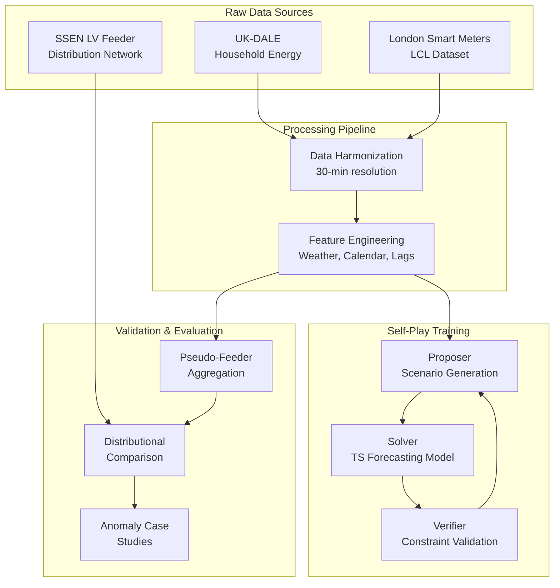

# AZR-inspired Energy Forecasting & Anomaly Detection

[](https://github.com/vatsalmehta/FYP-Predictive_Anomaly_Detection/actions)
[](https://opensource.org/licenses/MIT)
[](https://www.python.org/downloads/)

A production-grade machine learning system that adapts the propose→solve→verify self-play paradigm from **Absolute Zero Reasoner (AZR)** ([arXiv:2505.03335](https://arxiv.org/abs/2505.03335)) to time series forecasting and anomaly detection in energy consumption data.

## 🚀 Project Vision

This Final Year Project explores how self-play reinforcement learning can enhance time series forecasting by training models to propose challenging scenarios, solve them accurately, and verify solutions through realistic constraints. We focus on household energy consumption prediction with validation against real distribution network feeders.

**Key Innovation**: Unlike traditional supervised learning on historical data, our approach generates synthetic scenarios that stress-test model capabilities while maintaining physical plausibility through verifiable reward signals.

## 📊 Data Flow Architecture



## 🎯 Why This Stands Out

- **Latest Architectures**: PatchTST and N-BEATS variants with uncertainty quantification
- **Verifiable Rewards**: Physics-based constraints ensure realistic scenario generation
- **Multi-Scale Validation**: Household-level accuracy with feeder-level realism checks
- **Production MLOps**: DVC data versioning, MLflow experiment tracking, comprehensive CI/CD
- **Uncertainty Quantification**: Quantile regression heads and Monte Carlo dropout
- **Open Science**: Reproducible experiments with clear data governance

## 🏃‍♂️ Quick Start

### Prerequisites
- Python 3.11+
- [Poetry](https://python-poetry.org/) for dependency management
- Git with LFS support

### Installation

```bash
# Clone the repository
git clone https://github.com/vatsalmehta/FYP-Predictive_Anomaly_Detection.git
cd FYP-Predictive_Anomaly_Detection

# Install dependencies
poetry install

# Activate virtual environment
poetry shell

# Install pre-commit hooks
pre-commit install

# Initialize DVC (if not already done)
dvc init

# Run smoke tests
pytest tests/

# Verify pipeline (placeholder stages)
dvc repro
```

### Running Locally

```bash
# Check code quality
pre-commit run --all-files

# Run full test suite
pytest tests/ -v

# Check pipeline status
dvc status

# View experiment tracking (when available)
mlflow ui
```

## 📁 Project Structure

```
├── .github/           # GitHub workflows and issue templates
├── docs/              # Comprehensive documentation
├── notebooks/         # Jupyter notebooks for exploration
├── src/fyp/          # Main package source code
├── tests/            # Test suite
├── data/             # Data directories (DVC tracked)
│   ├── raw/          # Original datasets (gitignored)
│   ├── processed/    # Cleaned and transformed data
│   └── derived/      # Model outputs and artifacts
└── dvc.yaml          # DVC pipeline definition
```

## 🔒 Ethics & Privacy

- **No PII Joins**: Personal identifiable information is never linked across datasets
- **SSEN Validation Only**: Distribution network data used solely for external validation
- **Anonymized Analysis**: All household-level analysis maintains user anonymity
- **Data Minimization**: Only essential features extracted for modeling purposes
- **Transparent Methods**: All processing steps documented and reproducible

## 📖 Documentation

- [**Datasets**](docs/datasets.md): UK-DALE, London Smart Meters, and SSEN LV Feeder details
- [**Data Governance**](docs/data_governance.md): DVC setup, provenance, and retention policies
- [**Self-Play Design**](docs/selfplay_design.md): Propose→solve→verify architecture for time series
- [**Experiments**](docs/experiments.md): MLflow organization and naming conventions
- [**Feeder Evaluation**](docs/feeder_eval.md): Validation methodology against real networks

## 🤝 Contributing

We welcome contributions! Please see our [Contributing Guide](CONTRIBUTING.md) for details on:
- Development workflow and branch management
- Code style and testing requirements
- Experiment tracking best practices

Please read our [Code of Conduct](CODE_OF_CONDUCT.md) before participating.

## 📄 License

This project is licensed under the MIT License - see the [LICENSE](LICENSE) file for details.

## 📚 Citation

If you use this work in your research, please cite:

```bibtex
@software{fyp_energy_forecasting,
  title = {AZR-inspired Energy Forecasting & Anomaly Detection},
  author = {Your Name},
  year = {2025},
  url = {https://github.com/vatsalmehta/FYP-Predictive_Anomaly_Detection}
}
```

See [CITATION.cff](CITATION.cff) for complete citation metadata.

## 🔗 Related Work

- [Absolute Zero Reasoner (AZR)](https://arxiv.org/abs/2505.03335) - Propose→solve→verify paradigm we adapt
- [PatchTST](https://arxiv.org/abs/2211.14730) - Patch-based transformer for time series
- [N-BEATS](https://arxiv.org/abs/1905.10437) - Neural basis expansion analysis for forecasting
- [UK-DALE](https://arxiv.org/abs/1404.0284) - UK Domestic Appliance-Level Electricity dataset