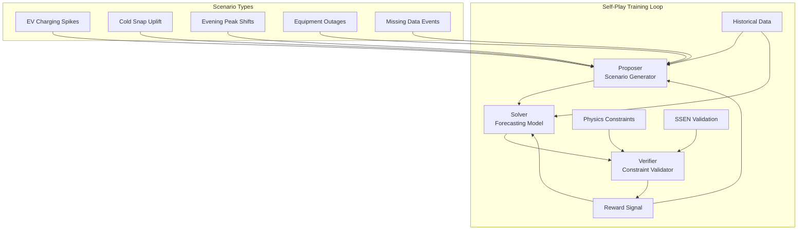

# Self-Play Architecture for Time Series Forecasting

This document outlines the implementation-agnostic design of the propose→solve→verify self-play paradigm adapted for energy consumption time series forecasting and anomaly detection.

## Overview

Traditional supervised learning for time series forecasting relies on historical patterns, but struggles with novel scenarios and distribution shifts. Our self-play approach, inspired by AlphaZero Research (AZR), enables models to generate challenging but realistic scenarios, solve them accurately, and verify solutions through physics-based constraints.

### Core Philosophy
- **Proposer**: Generate diverse, challenging consumption scenarios
- **Solver**: Develop robust forecasting capabilities across scenarios  
- **Verifier**: Ensure physical plausibility and reward realistic solutions
- **Self-Improvement**: Iterative refinement through verifiable feedback

## Three-Component Architecture



## Component 1: Proposer (Scenario Generator)

### Purpose
Generate diverse, challenging but realistic consumption scenarios that stress-test the forecasting model's capabilities beyond historical patterns.

### Scenario Categories

#### 1. Electric Vehicle (EV) Charging Spikes
**Description**: Sudden high-power demand periods representing EV charging events.
```python
class EVSpike:
    power_range: (3.5, 7.0)  # kW typical EV charging
    duration_range: (1, 8)    # hours
    timing_probs: {
        "evening_peak": 0.6,   # 18:00-22:00
        "overnight": 0.3,      # 00:00-06:00  
        "random": 0.1
    }
    seasonal_modifier: winter_boost * 1.2  # heating + charging
```

#### 2. Cold Snap Uplift
**Description**: Weather-driven consumption increases during extreme cold periods.
```python
class ColdSnapUplift:
    trigger_temp: (-5, 2)     # °C threshold range
    magnitude_range: (1.5, 3.0)  # multiplier of baseline heating
    duration_range: (6, 72)   # hours of sustained cold
    recovery_pattern: "exponential_decay"
    affects_appliances: ["heating", "hot_water", "cooking"]
```

#### 3. Evening Peak Shifts
**Description**: Changes in daily routine affecting traditional peak hours.
```python
class EveningPeakShift:
    shift_range: (-3, +3)     # hours from normal peak
    magnitude_change: (0.7, 1.4)  # peak intensity modifier
    duration_change: (0.5, 2.0)   # peak width modifier
    triggers: ["holidays", "events", "daylight_saving", "remote_work"]
```

#### 4. Equipment Blackout/Dip Events
**Description**: Sudden load reductions due to equipment failures or power outages.
```python
class BlackoutDip:
    magnitude_range: (0.1, 0.9)  # fraction of normal consumption
    duration_range: (0.5, 6)     # hours
    recovery_pattern: ["immediate", "gradual", "overshoot"]
    affected_circuits: ["lighting", "appliances", "partial_house"]
```

#### 5. Data Missingness Events
**Description**: Realistic missing data patterns for robustness testing.
```python
class MissingnessEvent:
    pattern_types: ["random", "systematic", "burst", "sensor_drift"]
    duration_range: (0.5, 24)    # hours
    missingness_rate: (0.1, 0.8) # fraction missing
    realistic_causes: ["meter_failure", "communication_loss", "maintenance"]
```

### Proposer Training Objectives
1. **Diversity**: Generate scenarios spanning the full realistic parameter space
2. **Difficulty**: Create challenging cases that expose solver weaknesses  
3. **Realism**: Maintain physical and behavioral plausibility
4. **Novelty**: Avoid repetitive or trivial scenario generation

### Scenario Parameterization
```python
class ScenarioProposal:
    base_consumption: np.ndarray    # Historical baseline
    scenario_type: ScenarioType     # One of the 5 categories above
    parameters: Dict[str, float]    # Scenario-specific parameters
    temporal_context: Dict          # Time of year, weather, etc.
    uncertainty_level: float        # Proposed difficulty level
    
    def apply_to_timeseries(self, baseline: np.ndarray) -> np.ndarray:
        """Apply scenario transformation to baseline consumption."""
        pass
    
    def get_verification_constraints(self) -> List[Constraint]:
        """Return physics constraints this scenario must satisfy."""
        pass
```

## Component 2: Solver (Forecasting Model)

### Purpose
Develop robust forecasting capabilities that generalize well across both historical patterns and proposed scenarios.

### Architecture Flexibility
The solver can use any time series forecasting architecture:
- **PatchTST variants**: Patch-based transformers with energy-specific modifications
- **N-BEATS adaptations**: Interpretable neural basis expansion
- **Hybrid approaches**: Combining statistical and neural methods
- **Uncertainty-aware models**: Quantile regression or distributional outputs

### Training Process
```python
class SolverTraining:
    def train_episode(self, proposed_scenario, historical_context):
        """Train on mix of historical data and proposed scenarios."""
        
        # 1. Get scenario from proposer
        scenario = self.proposer.generate_scenario()
        
        # 2. Apply scenario to create training target
        modified_timeseries = scenario.apply_to_timeseries(historical_context)
        
        # 3. Train forecasting model
        forecast = self.solver_model.predict(context_window)
        loss = self.compute_loss(forecast, modified_timeseries)
        
        # 4. Get verification feedback
        verification_score = self.verifier.evaluate(forecast, scenario)
        
        # 5. Update model with combined loss
        total_loss = loss + self.alpha * verification_score
        self.solver_model.update(total_loss)
        
        return forecast, verification_score
```

### Key Training Principles
1. **Mixed Training**: Combine historical data with proposed scenarios
2. **Progressive Difficulty**: Gradually increase scenario complexity
3. **Uncertainty Quantification**: Output prediction intervals, not just point estimates
4. **Constraint Awareness**: Learn to respect physics-based limitations

## Component 3: Verifier (Constraint Validator)

### Purpose
Evaluate the physical plausibility and realistic feasibility of forecasts, providing verifiable reward signals for the self-play loop.

### Constraint Categories

#### 1. Non-Negativity Constraints
```python
class NonNegativityConstraint:
    """Energy consumption cannot be negative."""
    def evaluate(self, forecast: np.ndarray) -> float:
        violations = np.sum(forecast < 0)
        penalty = violations / len(forecast)
        return -penalty  # Negative reward for violations
```

#### 2. Ramp Rate Limits
```python
class RampRateConstraint:
    """Realistic limits on consumption change rates."""
    def __init__(self):
        self.max_ramp_30min = 2.0  # kW per 30-minute period
        
    def evaluate(self, forecast: np.ndarray) -> float:
        ramp_rates = np.diff(forecast) / 0.5  # per 30-min
        violations = np.sum(np.abs(ramp_rates) > self.max_ramp_30min)
        penalty = violations / len(ramp_rates)
        return -penalty
```

#### 3. Energy Budget Consistency
```python
class EnergyBudgetConstraint:
    """Daily/weekly energy totals must be realistic."""
    def __init__(self, historical_percentiles):
        self.daily_energy_bounds = historical_percentiles  # [p5, p95]
        
    def evaluate(self, forecast: np.ndarray) -> float:
        daily_energy = self.aggregate_to_daily(forecast)
        in_bounds = np.logical_and(
            daily_energy > self.daily_energy_bounds[0],
            daily_energy < self.daily_energy_bounds[1]
        )
        compliance = np.mean(in_bounds)
        return compliance  # Higher reward for realistic totals
```

#### 4. Temporal Pattern Plausibility
```python
class TemporalPatternConstraint:
    """Weekday/weekend and holiday patterns must be realistic."""
    def __init__(self, pattern_models):
        self.weekday_model = pattern_models['weekday']
        self.weekend_model = pattern_models['weekend']
        self.holiday_model = pattern_models['holiday']
        
    def evaluate(self, forecast: np.ndarray, temporal_context: Dict) -> float:
        expected_pattern = self.get_expected_pattern(temporal_context)
        pattern_similarity = self.compute_similarity(forecast, expected_pattern)
        return pattern_similarity
```

#### 5. Feeder Population Bounds
```python
class FeederBoundsConstraint:
    """Aggregated consumption must match realistic feeder characteristics."""
    def __init__(self, ssen_statistics):
        self.feeder_load_bounds = ssen_statistics['load_bounds']
        self.feeder_diversity_factors = ssen_statistics['diversity']
        
    def evaluate(self, aggregated_forecast: np.ndarray) -> float:
        # Compare statistical properties with SSEN feeder data
        load_factor = self.compute_load_factor(aggregated_forecast)
        diversity_factor = self.compute_diversity_factor(aggregated_forecast)
        
        realism_score = self.compare_with_ssen_statistics(
            load_factor, diversity_factor
        )
        return realism_score
```

### Composite Reward Function
```python
class CompositeVerifier:
    def __init__(self, constraint_weights):
        self.constraints = [
            NonNegativityConstraint(),
            RampRateConstraint(), 
            EnergyBudgetConstraint(),
            TemporalPatternConstraint(),
            FeederBoundsConstraint()
        ]
        self.weights = constraint_weights
        
    def evaluate(self, forecast: np.ndarray, scenario: ScenarioProposal) -> float:
        """Compute weighted combination of constraint scores."""
        scores = []
        for constraint in self.constraints:
            score = constraint.evaluate(forecast, scenario.temporal_context)
            scores.append(score)
            
        # Weighted combination
        total_score = np.sum([w * s for w, s in zip(self.weights, scores)])
        
        # Optional: Apply scenario difficulty modifier
        difficulty_bonus = scenario.uncertainty_level * self.difficulty_weight
        
        return total_score + difficulty_bonus
```

## Self-Play Training Loop

### Training Algorithm
```python
class SelfPlayTrainer:
    def __init__(self, proposer, solver, verifier):
        self.proposer = proposer
        self.solver = solver  
        self.verifier = verifier
        
    def train_episode(self):
        """Single episode of propose→solve→verify training."""
        
        # 1. PROPOSE: Generate challenging scenario
        scenario = self.proposer.generate_scenario()
        
        # 2. SOLVE: Forecast under the proposed scenario  
        context = self.get_historical_context()
        forecast = self.solver.predict(context, scenario)
        
        # 3. VERIFY: Evaluate forecast plausibility
        verification_score = self.verifier.evaluate(forecast, scenario)
        
        # 4. UPDATE: Improve based on verification feedback
        self.update_proposer(scenario, verification_score)
        self.update_solver(forecast, verification_score)
        
        return {
            'scenario': scenario,
            'forecast': forecast, 
            'verification_score': verification_score
        }
        
    def train(self, num_episodes):
        """Full self-play training process."""
        for episode in range(num_episodes):
            results = self.train_episode()
            self.log_episode_results(episode, results)
            
            # Periodic evaluation against historical data
            if episode % 100 == 0:
                self.evaluate_on_test_set()
```

### Verifiable Rewards Benefits

#### 1. Label-Efficient Learning
- **Problem**: Limited labeled anomaly data in energy consumption
- **Solution**: Physics constraints provide abundant supervision signal
- **Benefit**: Learn from unlabeled scenarios through constraint satisfaction

#### 2. Distribution Shift Robustness  
- **Problem**: Historical patterns may not generalize to future scenarios
- **Solution**: Self-generated scenarios test model robustness
- **Benefit**: Better performance on novel consumption patterns

#### 3. Interpretable Model Behavior
- **Problem**: Black-box models difficult to trust in critical infrastructure
- **Solution**: Constraint violations provide clear failure explanations
- **Benefit**: Enhanced model explainability and debugging capabilities

#### 4. Safety and Reliability
- **Problem**: Unrealistic forecasts could mislead grid operators
- **Solution**: Physics constraints ensure forecast feasibility
- **Benefit**: Improved safety for deployment in energy systems

## Risks and Mitigation Strategies

### Risk 1: Reward Hacking
**Description**: Model learns to satisfy constraints without improving forecasting accuracy.

**Mitigation Strategies**:
- Balance constraint rewards with historical data accuracy
- Regular evaluation on held-out test sets
- Constraint diversity to prevent narrow optimization
- Human expert review of generated scenarios

### Risk 2: Unrealistic Scenario Generation
**Description**: Proposer generates scenarios that violate physical laws or behavioral patterns.

**Mitigation Strategies**:
- Proposer training with physics-informed priors
- Regular validation against expert knowledge
- Integration of real anomaly data for calibration
- Conservative bounds on scenario parameters

### Risk 3: Training Instability
**Description**: Self-play loop may converge to poor local optima or fail to converge.

**Mitigation Strategies**:
- Curriculum learning with gradually increasing difficulty
- Mixed training with historical data throughout
- Regular checkpointing and rollback capabilities
- Multiple random initializations to find robust solutions

### Risk 4: Computational Complexity
**Description**: Three-model training may be computationally expensive.

**Mitigation Strategies**:
- Efficient model architectures and training procedures
- Parallel training of components where possible
- Progressive training (baseline→enhanced→self-play)
- Cloud computing resources for large-scale experiments

## Implementation Roadmap

### Phase 1: Foundation (Weeks 1-4)
- Implement basic proposer, solver, verifier components
- Define constraint evaluation framework
- Create simple scenario generation (EV spikes only)
- Establish training loop infrastructure

### Phase 2: Core Development (Weeks 5-8)  
- Expand scenario types (all 5 categories)
- Implement advanced solver architectures (PatchTST, N-BEATS)
- Develop comprehensive constraint evaluation
- Initial self-play training experiments

### Phase 3: Integration & Evaluation (Weeks 9-12)
- Full system integration and testing
- Validation against SSEN feeder data  
- Comparison with baseline forecasting methods
- Performance analysis and optimization

### Phase 4: Analysis & Documentation (Weeks 13-16)
- Comprehensive evaluation across scenarios
- Ablation studies on component contributions
- Results analysis and interpretation
- Final documentation and thesis writing

This self-play design provides a robust framework for improving time series forecasting through verifiable constraints while maintaining physical realism and enabling systematic evaluation against real-world distribution network data.
